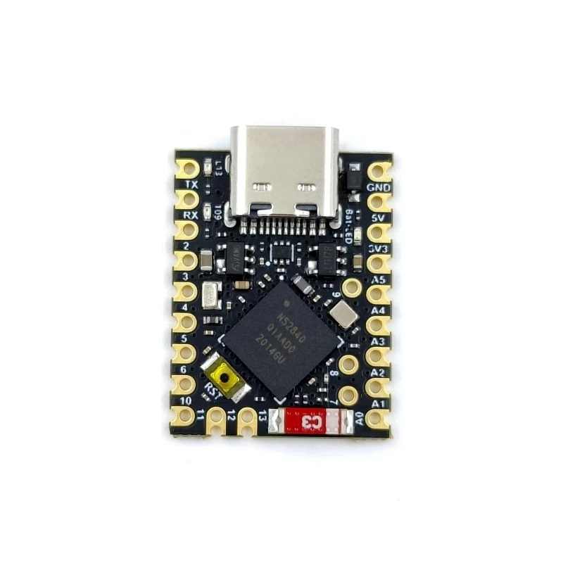

# Zephyr RTOS Board Definitions

This repository provides board definitions for [Zephyr RTOS](https://www.zephyrproject.org).

## Super Mini NRF52840 XS

The "Super Mini NRF52840 XS" board is a development board with very compact dimensions (23.5 mm x 18.0 mm) and a comparatively high  count of broken out IOs.

#### Board Description

The Zephyr board definition for the "Super Mini NRF52840 XS" is based on the pinout images provided by the seller ICBbuy and is partially derived from the "Arduino Nano 33 BLE" board definition due to hardware similarities and the preinstalled SAM-BA compatible bootloader.

A more [detailed description](arm/supermini_xs_nrf52840/doc/index.rst) of the board is included in the board's doc folder.

#### Hardware Hack

The currently available board revision is suitable for general use but not for ultra low power designs due to its comparatively high current draw (80 µA off, 550 µA standby).

The board description also includes a hardware hack to reduce the power consumption somewhat. If you find a way to reduce the power consumption even further please raise an [issue](issues).

## Installation

Merge the contents of this repository into your Zephyr directory. Then you can configure a Zephyr build environment for the board named *"supermini_xs_nrf52840"*.

## License and Credits

Copyright (c) 2024 [Jens B.](https://github.com/jnsbyr)

All board and pinout images have been provided by the seller ICBbuy on Aliexpress.