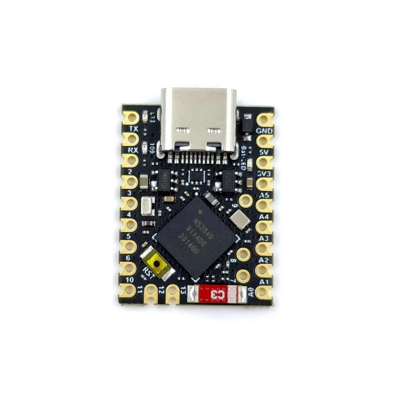
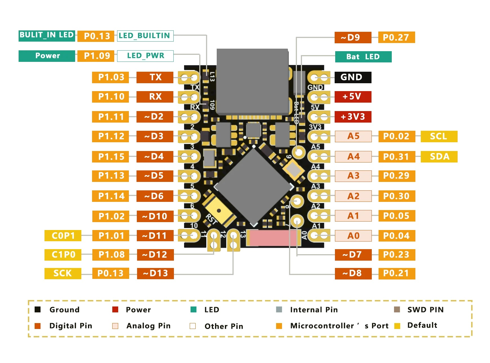
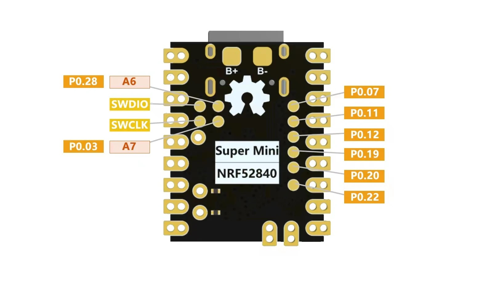

.. _supermini_xs_nrf52840:

Super Mini NRF52840 XS
######################

Overview
********

The Super Mini NRF52840 XS is a tiny (23.5 mm x 18.0 mm) Nordic Semiconductor
nRF52840 ARM Cortex-M4F development board with onboard LEDs, USB port, battery
charger, and a range of I/Os broken out via 20 through-holes and 12 pads on the
bottom side of the board.

The board is sold e.g. by ICBbuy on Aliexpress. On the product package there is
a label from Shenzhen Qiushi Wulian Technology Co. Ltd.

The `ICBbuy wiki`_ provides a few infos about a larger identically named board
but not this specific board and several specs differ. The board is also
mentioned by `joric on GitHub`_.

The board reports as 'Nano_33_BLE' when connected via USB. It has several
similarities with the Arduino Nano 33 BLE, e.g. same MCU and LED on D13, but
also several differences, e.g. form factor, pinout, GPIO pin mapping and no
accelerometer. Still, for a quick start the blink example for the Arduino
Nano 33 BLE board can be used.

A double click on the reset button activates the serial upload mode (yellow LED
fading in and out).

Hardware
********

- Nordic nRF52840 Cortex-M4F
- 32 MHz crystal
- 3 LEDs
- USB-C connector
- 3.3 V LDO regulator
- LiPo battery pads and USB charger (LTH7R, 300 mA charging current - not tested)
- Reset button
- Bluetooth antenna
- SWD pads

Supported Features
==================

The supermini_xs_nrf52840 board configuration supports the following hardware features:

+-----------+------------+----------------------+
| Interface | Controller | Driver/Component     |
+===========+============+======================+
| ADC       | on-chip    | adc                  |
+-----------+------------+----------------------+
| CLOCK     | on-chip    | clock_control        |
+-----------+------------+----------------------+
| FLASH     | on-chip    | flash, QSPI flash    |
+-----------+------------+----------------------+
| GPIO      | on-chip    | gpio                 |
+-----------+------------+----------------------+
| I2C(M)    | on-chip    | i2c                  |
+-----------+------------+----------------------+
| MPU       | on-chip    | arch/arm             |
+-----------+------------+----------------------+
| NVIC      | on-chip    | arch/arm             |
+-----------+------------+----------------------+
| PWM       | on-chip    | pwm                  |
+-----------+------------+----------------------+
| RADIO     | on-chip    | Bluetooth,           |
|           |            | ieee802154           |
+-----------+------------+----------------------+
| RTC       | on-chip    | system clock         |
+-----------+------------+----------------------+
| SPI(M/S)  | on-chip    | spi                  |
+-----------+------------+----------------------+
| UART      | on-chip    | serial               |
+-----------+------------+----------------------+
| USB       | on-chip    | usb                  |
+-----------+------------+----------------------+
| WDT       | on-chip    | watchdog             |
+-----------+------------+----------------------+

Connections and IOs
===================

LEDs
----

* LED1 (yellow) = P0.13 (D13)
* LED2 (red) = P1.9
* LED3 (blue) = battery charger

Power Supply
************

The board can be powered

- over USB
- via the 5V pin
- via a LiPo battery connected to dedicated pads on the bottom of the board
- via 3V3 pin, requiring board modifications

The board consumes around 80 µA at 5V in system off mode when both LEDs
are switched off. In standby mode the supply current increases almost to
600 µA.

THIS BOARD DOES NOT SUPPORT ULTRA LOW POWER APPLICATIONS NEAR 1 µA.

Powering the board via the 3.3 V pin is possible, but not recommended, as
this will create a significant reverse current into the 5V plane, increasing
the consumption to more than 440 µA in system off mode when both LEDs are
switched off.

Currently no schematic is available, but it seems that the board makes no
difference between the 5V plane and the USB bus voltage plane.

The identically named larger board variant is reported to have had a similar
`power consumption issue`_ in an earlier board revision, caused by a pull-up
resistor for the 3.3 V LDO regulator. But the recommended
`power consumption workaround`_ to remove or replace this resistor cannot be
applied to this board.

As an alternative workaround one can lift the pins 3 and 5 of the 3.3 V LDO
from the board. Then the board consumes around 55 µA at 3 V in system off mode
when both LEDs are switched off. Note that this will disable the 3.3 V LDO
but the board can still be powered via USB as the nRF52840 will output 1.8 V
via VDD. This is also an indication that the pins VDDH and VBUS of the
nRF52840 are probably connected and the nRF52840 is wired for high voltage
mode.

Disabling the LiPo battery charger by lifting pin 4 will further reduce the
power consumption to approximately 10 µA at 3 V in system off mode when both
LEDs are switched off.

To "lift" a pin, place a needle under the pin and carefully lever it mostly
sideways and slightly up by applying pressure between the pin and the chip
case. The solder fixing a pin is comparatively soft and behaves similar to
glue. Once a certain amount of force is exceeded the pin will suddenly be
released. In most cases the pin can be moved back into its original position, providing sufficient contact to restore the original function.

Bootloader
**********

The board comes with an Arduino Nano 33 BLE compatible bootloader. Upload
mode can be activated by double clicking the reset button. Then the yellow
LED will start to fade in and out.

To upload firmware over USB the command line version of BOSSA is required
and should be included in the PATH environment variable. Only the version
installed via the Arduino IDE seems to work (e.g. 1.9.1-17-g89f3556),
while other version return the error "SAM-BA operation failed".

The following command can be used on Windows in the Visual Code nRF Connect
terminal:

west flash --build-dir <build subdir name> -r bossac --bossac-port <serial device, e.g. COM2>

References
**********

.. target-notes::

.. _ICBbuy wiki: https://wiki.icbbuy.com/doku.php?id=developmentboard:nrf52840

.. _joric on GitHub: https://github.com/joric/nrfmicro/wiki/Alternatives#supermini-nrf52840-zero

.. _power consumption issue: https://www.reddit.com/r/crkbd/comments/16teax1/supermini_nrf52840_development_board_compatible/

.. _power consumption workaround: https://github.com/joric/nrfmicro/wiki/Alternatives/092eba928883aff16d8a189ace17be561b58768f#supermini-nrf52840
